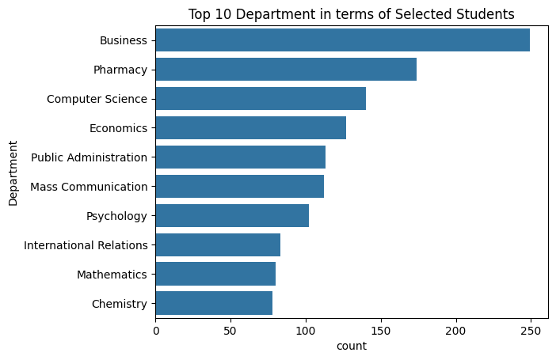

# 💻 Prime Minister Laptop Scheme – Data Analysis Project

This project analyzes student selection data from the Prime Minister Laptop Scheme to uncover patterns related to department-wise distribution, academic performance, and total allocation. Using Python and data visualization libraries, I cleaned and explored the dataset to generate actionable insights.

---

## 📁 Dataset Overview

- **File**: dataset_laptop_scheme.csv 

### 🔸 Dataset Columns:

| Column Name     | Description                                      |
|------------------|--------------------------------------------------|
| `S #`            | Serial number of the record                      |
| `Name`           | Student's name                                   |
| `Father Name`    | Student’s father’s name                          |
| `Enrollment No`  | Unique enrollment number                         |
| `Degree Title`   | Title of degree enrolled                         |
| `Department`     | Department of the student                        |
| `Year`           | Year of data entry (partially available)         |
| `Unnamed: 7`     | Unnamed/unused column                            |
| `Inter %`        | Intermediate (FSc) percentage                    |
| `CGPA`           | CGPA of the selected student                     |
| `Status`         | Selection status (e.g., Selected, Waiting)      |

---

## 🧰 Tools Used

- Python  
- Jupyter Notebook  
- Pandas  
- Matplotlib / Seaborn

---

## 📊 Analyses Performed

- 🧹 **Data Cleaning** – Handled missing values and removed unused columns  
- 📦 **Total Laptop Distribution Count** – Found how many students were selected  
- 🏛️ **Top 10 Departments** – Departments with the highest number of selected students  
- 📈 **Average CGPA** – Calculated the average academic performance of selected students  

All charts are saved as `.png` files inside the project directory.

---

## ▶️ How to Run This Project

1. Download or clone this repository  
2. Open `laptop_scheme_analysis.ipynb` in Jupyter Notebook or Google Colab  
3. Run the notebook step-by-step to reproduce the results and visualizations

---

## 📷 Sample Plot

---

## 📜 License

This project is open-source and free to use for educational purposes.
